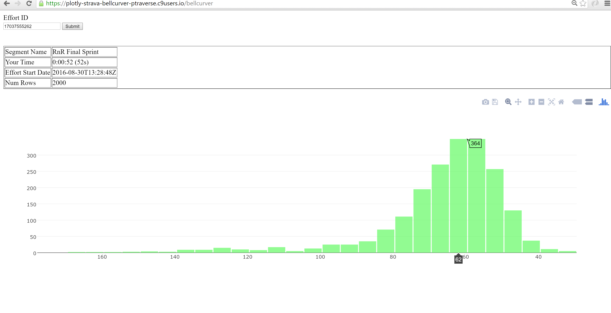

Plotly Strava Bellcurver
========================

Strava's leaderboards show rank within a set, but sometimes a picture is better. This project allows you to show how a histogram (aka bell curve) of other efforts on the same segment as the input effort.

https://plotly-strava-bellcurver-ptraverse.c9users.io/

https://github.com/ptraverse/plotly-strava-bellcurver

https://plot.ly/nodejs/histograms/

# Outline

For any list of efforts I want:

* Drawing as a bell curve
* Calc of std dev (x-axis scale)
* Average (mean)
* Y-axis scale (histogram)

# Dev Env

https://ide.c9.io/ptraverse/plotly-strava-bellcurver

# How do I get an Effort ID?

If you are viewing a specific Segment within an Activity, then EffortID will be in the URL.

Reminder:
* Activity = Going for a run
* Segment = Point A to Point B
* Effort = An Athlete doing a Segment within an Activity.

# t0d0s

* Add optional filters (start_date, end_date, athlete_id)
* Reactify ?
* Tests ?
* FrontEnd beautification

none of the todos will ever get done.